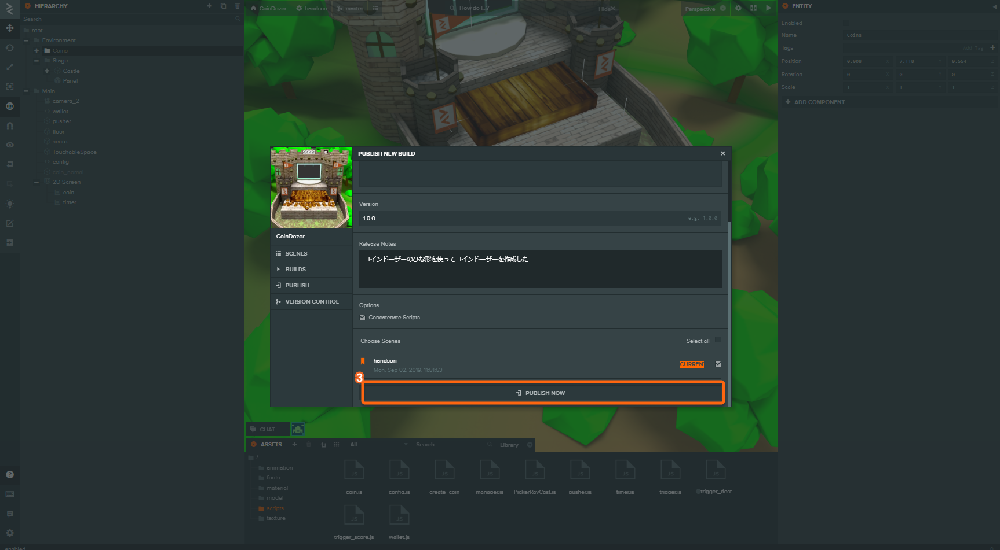
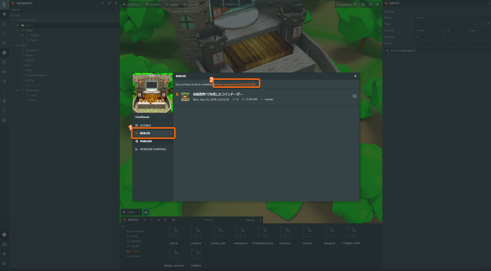
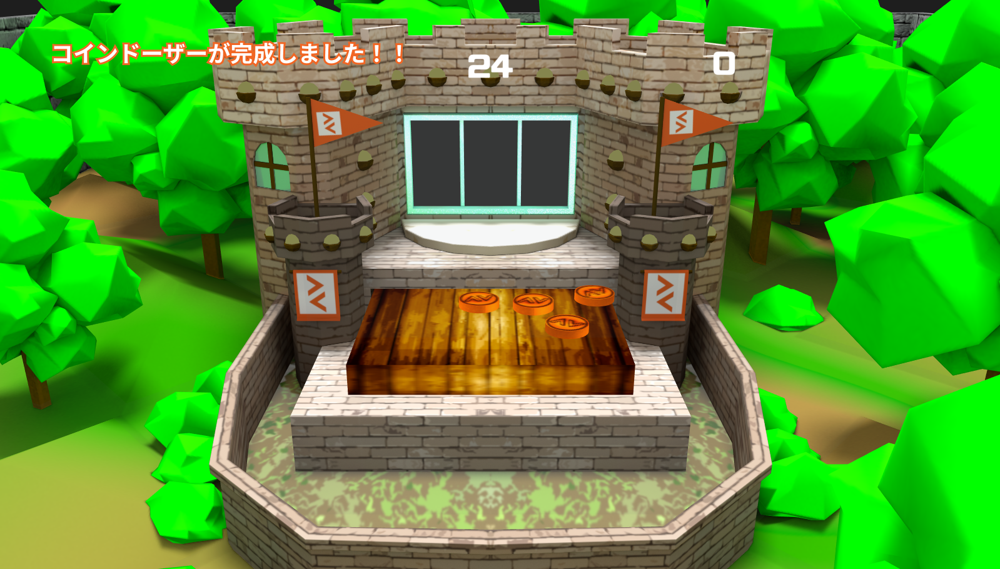
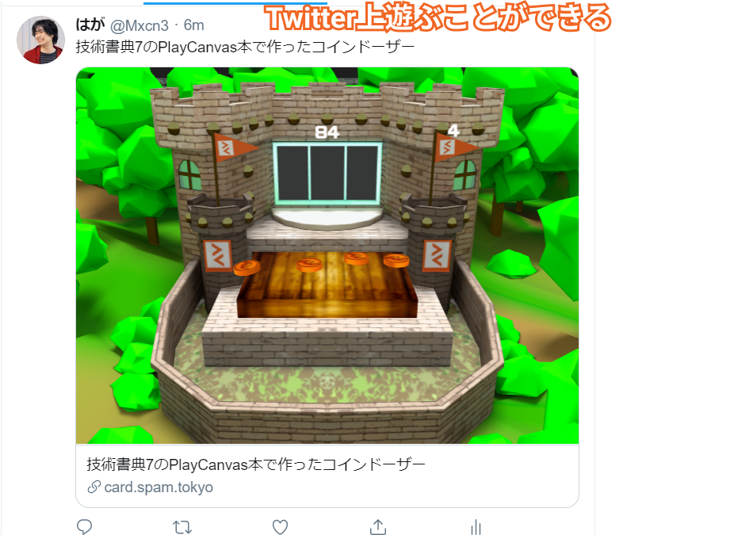

# 公開してみよう

### プロジェクトを公開しよう

PlayCanvasで作成をしたコインドーザーを公開します。 作ったコインドーザーをURLを発行して公開する`Publish`という機能と`Download`という機能があります。今回は`無料アカウント`で使える、`Publish`を使用して自分の作ったコインドーザーを公開します。

#### 1. Publish / Download をクリック

PUBLISH TO PLAYCANVASをクリックするとPUBLISH NEW BUILDというウィンドウに切り替わります。

#### 2. PUBLISH NEW BUILD をクリック

1, PUBLISH NEW BUILDをクリックします。

#### 3. プロジェクトの詳細を記入して PUBLISH NOW をクリック

PUBLISH NOWをクリックすることでURLが発行されそのURLを共有することでゲームを遊ぶことができます。

* タイトルここで設定したタイトルがタグに埋め込まれます
* サムネイル ファビコンおよび、PlayCanvasのプロジェクト画面で表示されます
* 説明
* バージョン
* リリースノート
* シーン

### プロジェクトを共有しよう。

1. `BUILD`をクリック
2. `Primary Build`のＵＲＬをクリック

### 公開された PlayCanvas のプロジェクトを遊んでみる

お疲れさまです。これでPlayCanvasを使用したプロジェクトの作成を一通り終わらせることができました。この発行した、URLを使って`Twitter`や`Facebook`などにシェアできます。

## 補足

### ツイート上に動くコンテンツとして共有する

TwitterにはTwitterカードと呼ばれる機能があり。OGPを設定することでその機能を使うことで`遊べるツイート`を作ることができます。 FacebookやLINEにも同様の機能が存在しています。

#### 1. Twitterカードジェネレータにアクセス

[https://generate.spam.tokyo](https://generate.spam.tokyo)

#### 2. 情報を入力してツイート

