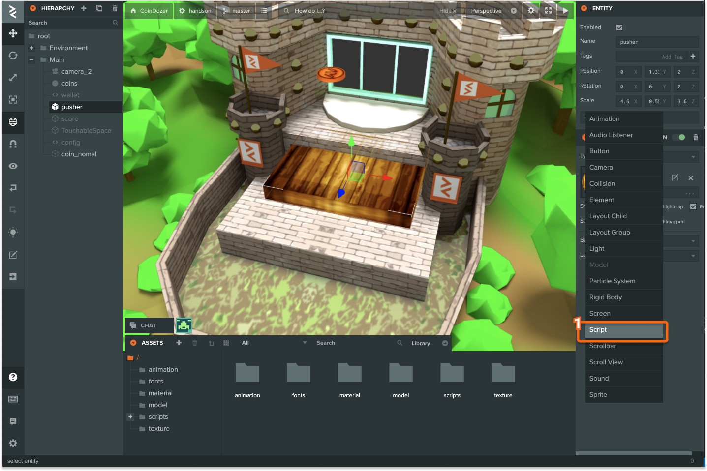
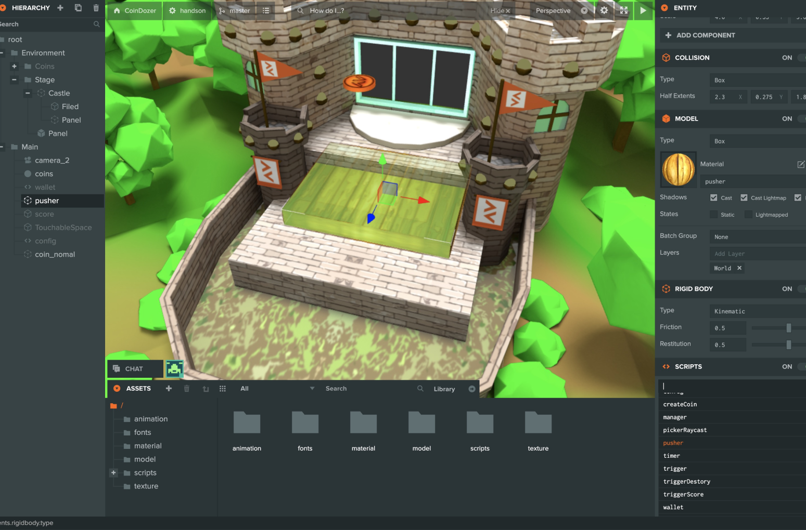
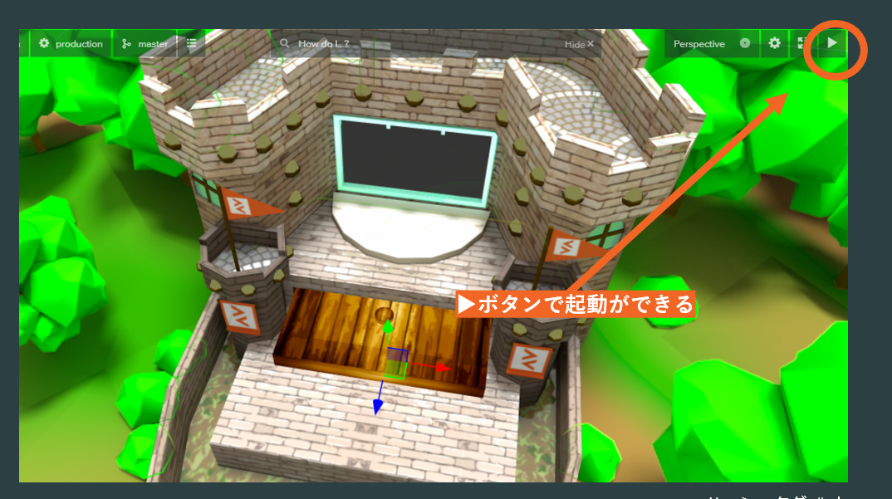
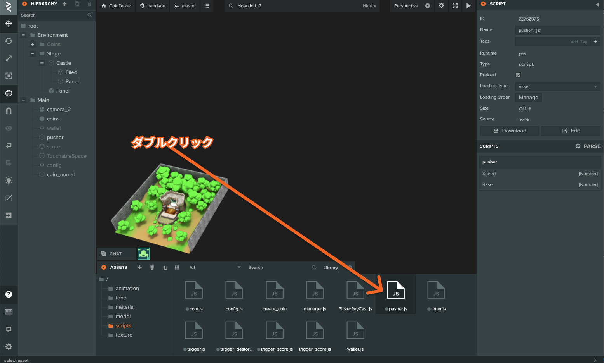

# プッシャーを動かす

## プッシャーを動かす

`スクリプトコンポーネント`に `スクリプト`を追加してコインドーザーのプッシャーを動かしていきましょう。

### 1. SCRIPTコンポーネントを追加する



### 2. ADD SCRIPTをクリック


ADD SCRIPTをクリックすると現在プロジェクト内に入っているスクリプト中からスクリプトを追加できます。

### 3. Pusher.jsスクリプトを追加



SCRIPTの検索欄から`pusher`選択します。

今回追加した`pusher.js`のソースコードこちらになります。

```javascript
const Pusher = pc.createScript("pusher");
Pusher.attributes.add("Speed", { type: "number", default: 0.01 });
Pusher.attributes.add("Base", { type: "number", default: 120 });

Pusher.prototype.initialize = function() {
  this.count = 0;
  this.mode = "push";
  this.base = this.Base;
  this.reverse = this.base * 2;
};

Pusher.prototype.update = function() {
  if (this.count < this.base && this.mode === "push") {
    this.entity.translate(0, 0, this.Speed);
  } else if (this.count < this.reverse && this.mode === "pull") {
    this.entity.translate(0, 0, -this.Speed);
  } else if (this.count > this.base && this.mode === "push") {
    this.mode = "pull";
  } else if (this.count > this.reverse && this.mode === "pull") {
    this.mode = "push";
    this.count = 0;
  }
  this.count++;
};

Pusher.prototype.swap = function(old) {};
```

### 4. 起動をしてみよう

▶ のボタンで作成したプログラムの起動\(Launch\)できます。後述しますがこの起動した際に表示されるURLは `ログイン`しているユーザーしかアクセスできません。



## プログラムの中身を見る

### 1. アセットからpusher.jsをダブルクリックする



今回追加した`pusher.js`については下のアセットタブから確認できます。 `pusher.js`をダブルクリックすることでコードエディタが開かれるのでソースコードを確認できます。

## translate関数

今回使用した関数としては、`this.entity.translate`という関数を使用しました。この`this.entity`というのはスクリプトを追加したエンティティ自身のこととなります。その中のtranslate関数を使用することでエンティティを移動させることができます。

```javascript
//translate関数のサンプル

//使い方
//this.entity.translate(xの移動量, zの移動量, yの移動量);

// 例　z方向に1移動する
this.entity.translate(0, 0, 1);
```

## PlayCanvasのライフサイクル

PlayCanvasでは指定した関数が一定ライフサイクルで呼び出される関数があり、`pusher.js`では`initialize`と`update`関数を使用されています。 swapはコードエディタプログラムの更新を取ることができるので、開発中にSwapに対して変更をされたらページを更新するなどのコードを入れておくと、画面の更新することなどということもできます。

| プロパティ | タイミング |
| ---: | :--- |
| initialize | 起動時 |
| update | フレーム毎 |
| swap | コードエディタなどによるプログラム更新時 |
| postInitialize | すべてのオブジェクトの読み込みが終わった際に一度 |
| postUpdate | すべてのスクリプトが更新された際に呼び出される |

### 参考リンク

1. PlayCanvas pc.Entity\#translate

[https://developer.playcanvas.com/en/api/pc.Entity.html\#translate](https://developer.playcanvas.com/en/api/pc.Entity.html#translate)

