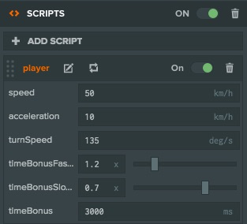
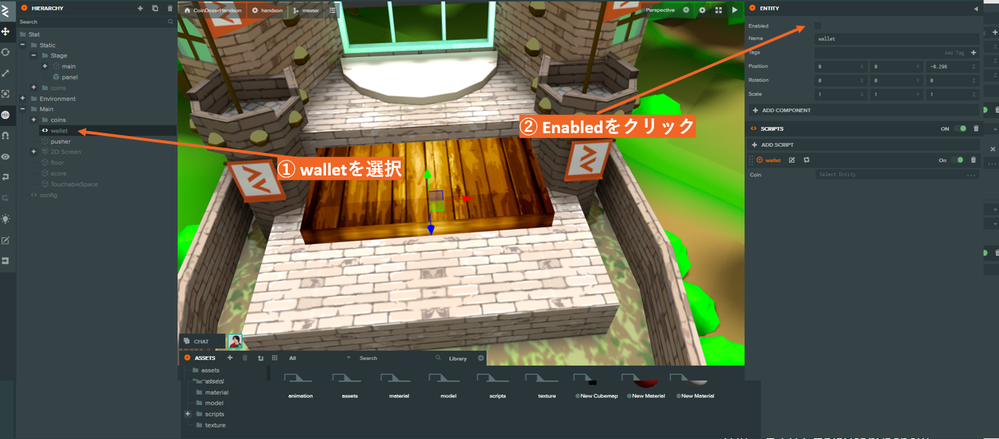
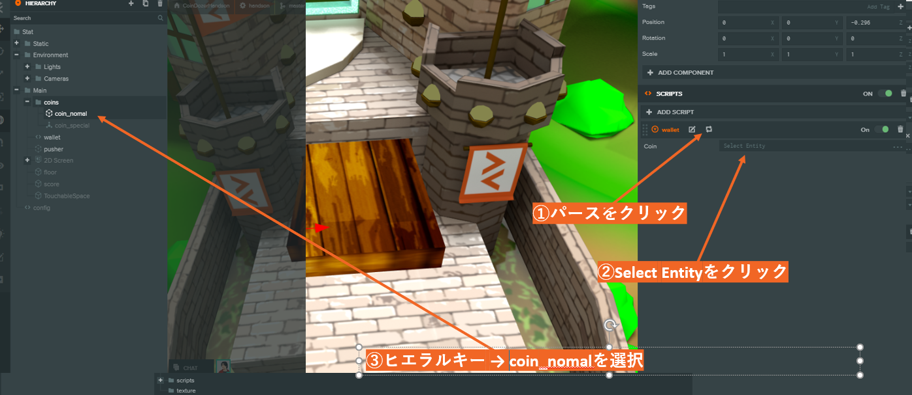
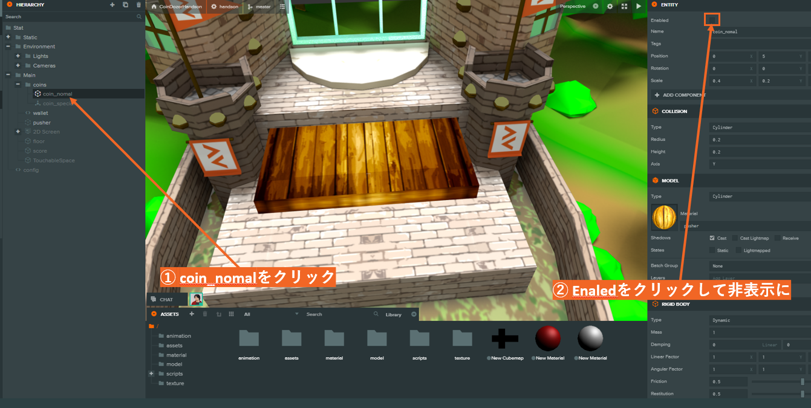

# テンプレート化をして1枚のコインを複製する

## テンプレート化をして1枚のコインを複製する

PlayCanvasでは`テンプレート化`という機能がありますこれは、Unityでいう`Prefab化`と同じようなものになります。 `テンプレート化`をするメリットとしては同じエンティティを複数用意せずとも、1つ用意することでそれを複製して使用できます。`Launch`ボタンからゲームを起動すると、今は１枚のコインが表示されています。この１枚のコインを`テンプレート化`し複数枚出現させます`属性`と`テンプレート化`の２つについてこの節では解説をしながら作っていきます。

## 属性について



PlayCanvasには`属性`\(Attributes\)という機能があり、コードを触らなくても、ゲーム内で使用される値を（初期値）`PlayCanvas Editor`から値を変更できます。

### 1. 隠れているエンティティを表示する



1. ヒエラルキーから`wallet`というエンティティを選択する
2. `Enabled` にチェックを入れます。

`wallet`というエンティティはあらかじめ`wallet.js`というスクリプトが追加されています。  
このエンティティは画面がタッチされたらコインを出すというスクリプトが追加されているエンティティで、大きさやコリジョンなどは持っておりませんが起動時には存在しているエンティティとなります。

```javascript
const wallet = pc.createScript("wallet");
wallet.attributes.add("Coin", { type: "entity" }); //複製するコインの型と名前を指定
wallet.prototype.initialize = function() {
  if (this.app.touch) {
    //もしタッチができる端末だったら
    this.app.touch.on(pc.EVENT_TOUCHSTART, this.create, this); //タッチされたらコインを出すcreate関数を呼ぶイベントを登録
  } else {
    this.app.mouse.on(pc.EVENT_MOUSEDOWN, this.create, this); // マウスが押されたらコインを出すcreate関数を呼ぶイベントを登録
  }
};

wallet.prototype.create = function() {
  const coin = this.Coin.clone(); // テンプレート化されたコインを取得する
  coin.setName("coin_nomal");
  coin.setLocalPosition(0, 10, 0);
  this.app.root.addChild(coin);
  coin.enabled = true; // 非表示になっているコインを表示する
};
```

### 2. 属性にコインを追加しテンプレート化をする



実際にコインのエンティティを`テンプレート化`をしてみます。

1. `wallet.js`の下にある`PARSE ボタン`をクリック
2. `Select Entity`をクリック
3. ヒエラルキーの中から`coin_nomal`を選択

これでテンプレートかができました、この`属性`という機能を使えばたとえば新しいコインをエンティティとして追加した場合にはそのコインを選択することで`コードを一切変更せずに表示するコインを変更できます`

### 3. 元から1枚表示されていたコインをデフォルトでは非表示にしておきます



これでゲームを起動すると、画面をタッチしたらコインが出現するようになりました。最初に表示されていたコインについては、コインドーザーとして最初に落ちてくるということは少し不気味なので非表示にしておきましょう。

* `coin_nomal`をクリック
* Enabledをクリックして非表示にします

この行為には複数の意味があり、それにつきましてはコインを削除するという章で説明をします。

## 複製について

wallet.jsではエンティティの複製に`clone()`関数を使用しています。この関数を使用してAttributesで設定したエンティティをクローンし、新しいエンティティを生み出しています。

これで起動をしてみるとプッシャーが動き、タップをするとコインの落ちるコインドーザーができているはずです。次の章では床に落ちたコインを消える処理を追加し、よりコインドーザーらしくしていきます。

