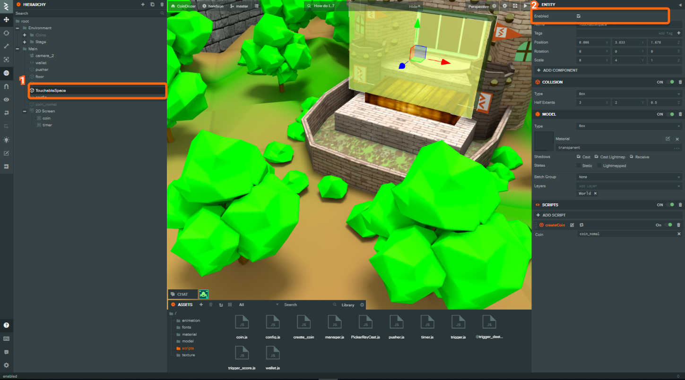
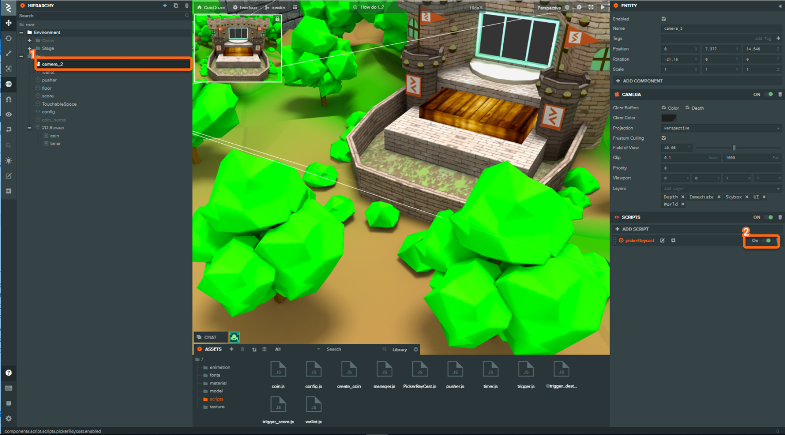
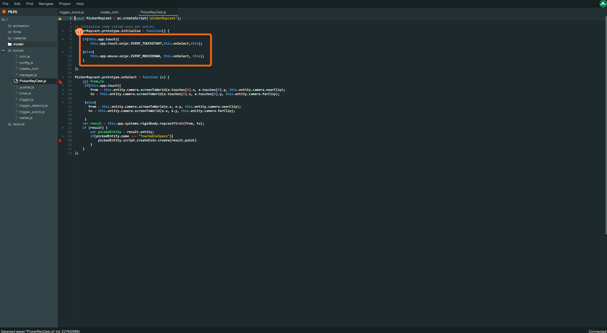
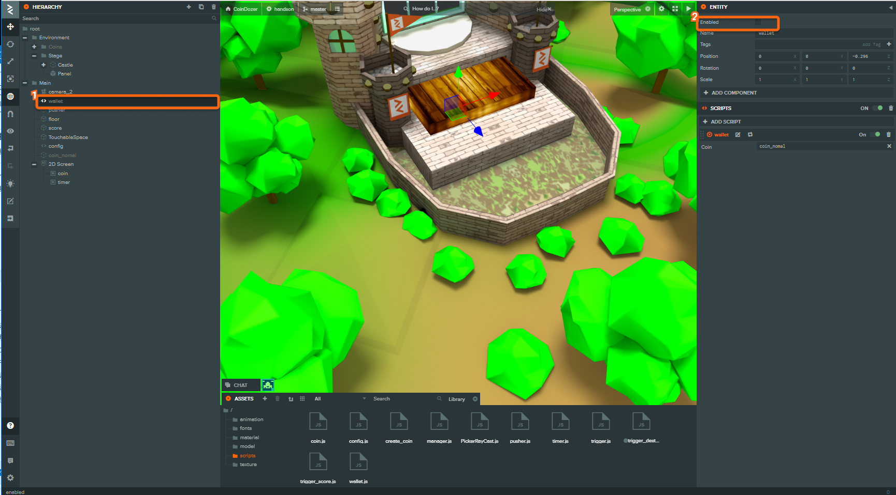

# 押された場所にコインを出す

## 押された場所にコインを出す

`Ray Cast`を使用して押された範囲場所にコインを出現させること、時間が立ったらコインを増やすというコードを追加していきます。

### 1. タッチできる領域を追加する



タッチできる領域を追加します。そのために`TouchableSpace`というあらかじめ用意されている`エンテティ`を表示します。

1. 非表示になっている`TouchableSpace`エンテティの`Enabled`にチェックを入れる。

この`TouchableSpace`にはあらかじめ`create_coin.js`というコインの枚数が1枚以上あった場合にコインを出すスクリプトが追加されています。

#### create\_coin.js

```javascript
const CreateCoin = pc.createScript("createCoin");
CreateCoin.attributes.add("Coin", { type: "entity" }); //テンプレート化するコインの型と名前を指定

CreateCoin.prototype.create = function(point) {
  if (WalletValue < 1) return;
  WalletValue--;
  const { x, y } = point; // 引数に押された場所(point)を取る
  const coin = this.Coin.clone(); // テンプレート化されたコインを取得する
  coin.setName("coin");
  coin.setLocalPosition(x, y, 0);
  this.app.root.addChild(coin);
  coin.enabled = true; // 非表示になっているコインを表示する
};
```

### 2. タッチされた場合にコインを出す



指定した領域をタッチした場合にコインを出すスクリプトをついかします。

1. Camera2の`pickerRayCast`スクリプトが`OFF`になっているので`ON`に切り替える。

#### picker\_raycast.js

```javascript
const PickerRaycast = pc.createScript("pickerRaycast");

PickerRaycast.prototype.initialize = function() {
  if (this.app.touch) {
    this.app.touch.on(pc.EVENT_TOUCHSTART, this.onSelect, this);
  } else {
    this.app.mouse.on(pc.EVENT_MOUSEDOWN, this.onSelect, this);
  }
};

PickerRaycast.prototype.onSelect = function(e) {
  let from, to;
  if (this.app.touch) {
    from = this.entity.camera.screenToWorld(
      e.touches[0].x,
      e.touches[0].y,
      this.entity.camera.nearClip
    );
    to = this.entity.camera.screenToWorld(
      e.touches[0].x,
      e.touches[0].y,
      this.entity.camera.farClip
    );
  } else {
    from = this.entity.camera.screenToWorld(
      e.x,
      e.y,
      this.entity.camera.nearClip
    );
    to = this.entity.camera.screenToWorld(e.x, e.y, this.entity.camera.farClip);
  }
  const result = this.app.systems.rigidbody.raycastFirst(from, to);
  if (result) {
    const pickedEntity = result.entity;
    if (pickedEntity.name === "TouchableSpace") {
      pickedEntity.script.createCoin.create(result.point);
    }
  }
};
```

## スマートフォンのタッチ対応



```javascript
if (this.app.touch) {
  //タッチがあるかどうかの判断をするタッチがあればタッチ、タッチがなければクリックで反応させる
  this.app.touch.on(pc.EVENT_TOUCHSTART, this.onSelect, this); //タッチされた場合にonSelect関数を呼ぶ
} else {
  this.app.mouse.on(pc.EVENT_MOUSEDOWN, this.onSelect, this); //クリックされた場合にonSelect関数を呼ぶ
}
```

* ① スマートフォンのタッチ動作については`this.app.touch`というプロパティが存在するかどうかでタッチ動作にするかPCとしてマウス操作にするかを判断しています。

### 3. wallet.js を非表示にする

 先ほど追加したスクリプトと`wallet`エンテティの中のスクリプトの役割がかぶっており、このままではコインが2枚出てきてしまうため、今までコインを追加するために使用していた`wallet`エンテティを非表示にします。

1. ヒエラルキーから`wallet`を選択
2. `Enable`のチェックを外す

## コインドーザーを確認する

任意の場所にタッチをすることと、自分の持っているコインの管理をする機能追加できました。 これでコインドーザーの作る流れの紹介は終わりになります。

