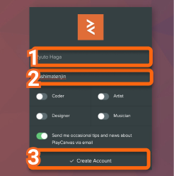
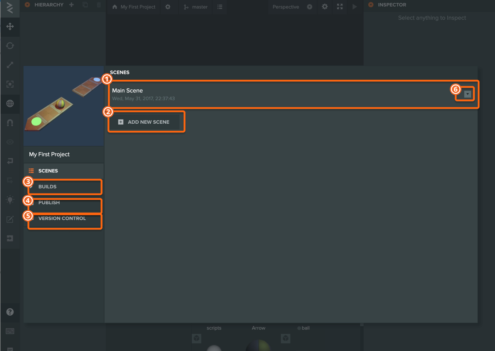

# Introduction

## アカウントの登録

エディタを使用するのには無料アカウントの登録が必要ですので、公式サイトにアクセスし無料アカウント作成をします。

PlayCanvas日本公式サイト  
[https://playcanvas.jp/](https://playcanvas.jp/)

### 1. メールアドレス・パスワードを入力

1. サインアップを選択
2. メールアドレスとパスワードを入力
3. サインアップをクリック

### 2. 名前・ユーザー名を入力

1. フルネームを入力
2. ユーザー名を入力
3. Create Accountをクリック

### 3.デモプロジェクトが開かれます

